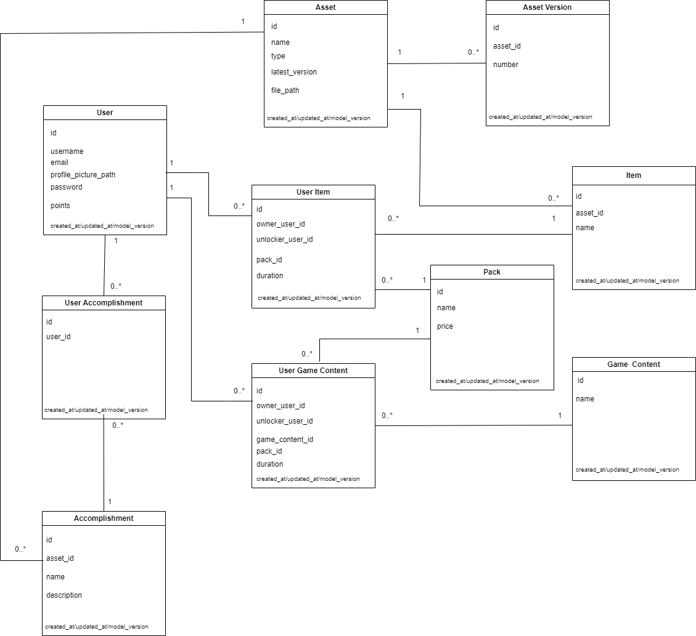

# Task 1 : Data Model design (theory)

*You are tasked with designing the data model for a video game content management system. The system needs to store information about game assets, players, and also focus on in-game events (battlepass, leaderboard, gifting…). Design a schema for these entities in a relational database. Include the necessary tables, fields, and relationships.*

Here is the data model schema, describing:
- Assets: Asset and Asset Version tables. Asset Version is created to keep track of the history of the file. In this case, only the metadata is stored in database, the file should be stored elsewhere.
limitations: As big files would be uploaded/downloaded. An "Asset Block" table is probably missing, to be able to stop/resume long files transfer.
- Battlepass: I chose to implement a Pack table that would contain either BattlePass (represented here as Game Content that would be unlocked), or/and game Items.
limitations: there is a price notion, but no payment system/transation is represented in this scope
- Leaderboard: could be easily generated with the "point" attribute in the User table.
I chose to ass an Accomplisment table, as most Game I know handles accomplisments.
limitations: the user table should probably be extended to separate user specific data and game specific data.
- Gifting: In User Item and User Game Content, we can see that there are two "user_id" attributes: owner_user_id is the person who will have the related "bonus" unlocked. unlocker_user_id is basically the person who bought the pack. So we will be able to give gift by updatinf the owner_user_id attribute.
limitations: that way, we can only gift Items ans Pass from packs.

Timing: 2h30

# Task 2 : Server Side programming

*In the framework of your choice, create a simple RESTful API that performs CRUD operations on a relevant ressource from your Data Model. You should access and execute the appropriate operations on your Database through your own Data Access layer.
Please provide installation and launching instructions for your server application.*

See documentation [here](../services/game-content/README.md) 

limitation: documentation, maybe some extra tests.

Timing: ~10h. I tried too many new tools. But if was fun !

# Task 3 : Client Side application

*Write a client application that consumes your API. The client application should allow users to perform all CRUD operations from your server API.
Please provide instructions on how to run your client application.*

I didn't write a client per se, but Fastapi sort of got my back on this point by providing useful tools:

- Swagger documentation, available at http://127.0.0.1:8000/docs once the server launched, with is perfect to manually test CRUD endpoints.
- A TestClient, used [here](../services/game-content/tests/conftest.py) for unit testing the endpoints.

# Task 4: Problem solving (theory)

*You are given a list of data updates that need to be applied to the database. 
How would you process those updates across the Full Stack (DB, server API and Client app) especially in the case where some updates depend on each other ?*

I would separate two use cases:
- non breaking updates: 
    The perfect example is adding an optionnal attribute to one model. It shouln't break anything Client side.
    My process would be:
    - make the changes
    - update the model_version attribute in the target model by updating the floating part (ie: from 1.0 to 1.1)
    - create a migration file if needed (/!\ don't forget about reverse migration to allow to rollback your release)
    - Update the Client when needed
- breaking updates (removing attribute, some updates depending on each other, add required attribues...)
    The process would be:
    - Create a new API version (V0 to V1) and rewrite all the target endpoints
    - Create a new model folder (V1) and rewrite all the targets models
    - Be very careful about migrations. There should be duplication of elements in DB.
        - attibute in easiest cases
        - tables duplication can be safer
        - Maybe for extreme cases, il would be better to duplicate the database itself (one for V0, and a completely different one for V1)
    
        Either way, the data stored should be compatible for both V0 and V1 endpoints.
    - When the V1 API is no longer supported, then the database can be cleanup of those derecated attributes/tables.
    - Update the Client when needed but before the end of the pervious API version support.

Timing: 20mn

# Bonus Task : DevOps skills (theory)

*Propose a basic CI/CD pipeline for the application using your preferred environment. Highlight the best practices related to your use and management of this kind of pipeline.*

I created a basic pipeline for tests and code formating [here](../.github/workflows/python-app.yml)

The missing steps would be:
- build: using docker build command to build the docker image
- publish: to publish the image in the chosen location
- deploy: deploy the image in a testing enviroment (probably using helm upgrade)
- integration tests

*Imagine an IaC template to provide instances for your web application, services, and your database server. Define stages in your pipeline for building the Docker image, running automated tests, and deploying to this infrastructure*

...Sorry =) 

Timing: 10mn

# Task 5: Code review

*Please take time to check your code quality, readability and maintainability. Also please ensure that your code is documented adequately and follows best practices for the environment and programming language you used.*

The code is missing some documentation, but should be readable as is.

# Task 6: Project environment

*Please create a GitHub repository for your test, and be attentive on your policy for organizing and committing your code.
Answers to theoretical questions and non-code related elements should be located in a dedicated part of your repository.*

Done !
